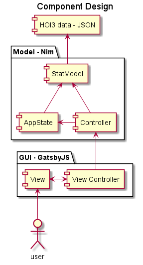
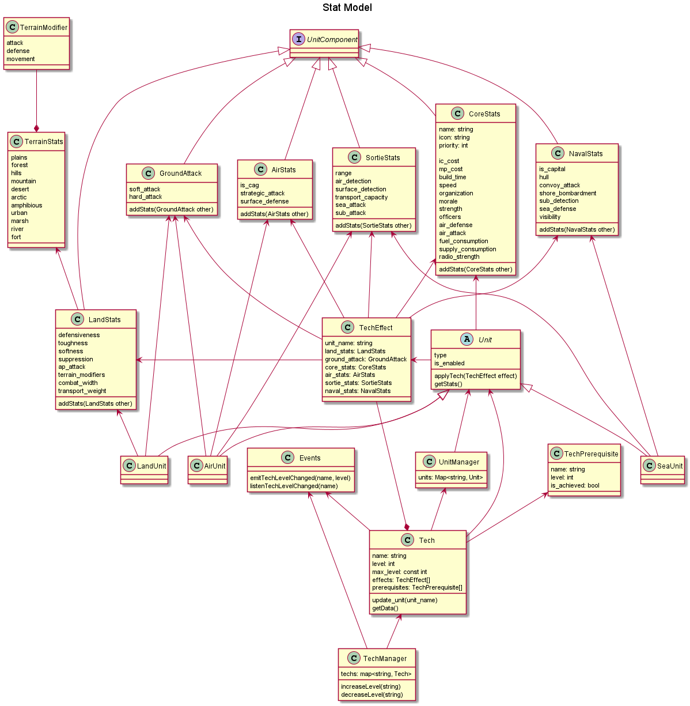

# HOI3 Division Designer - Design Document

## High Level Design
The model level will handle keeping track of techs and current unit stats in the StatModel, and tracking the state of the GUI in the AppState. The GUI level will use GatsbyJS and handle rendering the display in the View component. A ViewController is used to keep the write interface to the Model in one place.

## Model
The StatModel holds the current tech levels as they are added by the Controller, and recalculates unit stats. It will be queried by the AppState when it needs to render either Tech screens, or unit stats in the production screens. Controller is solely responsible for modifying StatModel. The GUI View only reads data from it in the render step.

AppState tracks which panel is active, if menu panes are open, current selection, and state of buttons. It is accessed by the View during rendering when they need state information. Controller will trigger View read of StatModel during the render process.

The Controller receives events from the GUI and coordinates the render process. First update StatModel, then update the AppState. Once the Controller returns, the View is ready to start updating.

## GUI
The View will use stateless React components. The state will be read from the AppState by the ViewController and fed into the top level React component, which will filter portions of state down into lower level components.

View is mobile-friendly, and will collapse into a single column on smaller screens. We can even separate the individual tech groups to collapse in width, but keep the prerequisite arrows.

Technology view looks like the HOI3 tech screen, with tech area tabs across the top to switch between different tech categories. Each category tab displays its layout of techs. Use the +/- interface from HOI3's custom start to add/subtract tech levels. Have a description box that states the prerequisites (link), unlocked techs (link), and effects of the current tech. 

Unit view is divided into 3 tabs: Land, Air, Sea. There is a central table that lists all the unit types. A formation box shows the selected units and quantities. The stats box shows calculated stats for the built formation.

A menu bar on the top of the screen 
